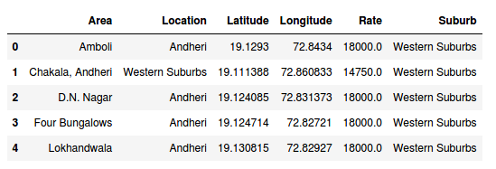

# Opening a Restaurant in Mumbai 

## Introduction

Mumbai is a bustling city in India. The diversity of the city can be seen by the food the city offers. Various cuisines with Parsi, Gujrati, South Indian, Muslim, and Maharastrian influence, Mumbai is a heaven for the taste buds. The street food here is as delicious as the food you get in a high end restaurant. So you can relish the food here without it being heavy on the pocket. 

In the metropolitan city there are various street food hotspots and high end places which are doing quite well for themselves. So, the question that arises for a person opening a new restaurant is where should he open one? What type of food is more prevalent and wanted by the people? Should it be near offices or not? What demographic should he focus on? Usually, answering these questions can be overwhelming and the answers are mostly speculative. But today with the help of data, we can get quite an accurate idea of what to expect from a neighborhood. 

So, this project will help people who are looking to open a restaurant in Mumbai.

## Data

To solve the problem, I have taken the latitude and longitude of [major neighborhoods](https://en.wikipedia.org/wiki/List_of_neighbourhoods_in_Mumbai#Antop_Hill) of Mumbai and also, the [commercial property rate](https://www.mumbaipropertyexchange.com/research/mumbai-property-rates) (per sqft.) there. The coordinates will help to find the popular food hotspots near that area and the property rates will guide as to how costly can the venture be. 

The latitude and the longitude when given to the foursquare API, will provide us with the food shops in the neighborhood. Say, for example we check food corners near Four Bungalows, Andheri, Mumbai. We will find that within one kilometer radius, there is a snack place, burger joint, cupcake shop, bakery, fast food restaurant, café and a BBQ joint. So from this we get that snacks and fast food are more prevalent in this region. Also, we see there are multiple residential buildings here and the commercial property rate there is Rs. 18000 per sqft. Now similarly we can compare this data with multiple other regions in Mumbai which will help us in more intelligent decision making. 

The final dataframe will look like this. 

  

## Exploratory Data Analysis

Foursquare API is a versatile tool which can be used to get venue recommendations, details of a venue, its photos, reviews, similar venues, and much more provided you have the coordinates of the place you want to discover.  

The coordinates we have of the 67 neighborhoods in Mumbai were fed to the Foursquare API to get max 100 venues in a 1 km radius of the coordinates. 1340 total food joints were discovered in these neighborhoods. These were plotted on the map.  

  

Next, I went on to find the category of restaurant which is dominating the suburbs of Mumbai.  

  

Indian Restaurants top the list having almost double the branches Fast Food Restaurants have. The rich use of spices and diversity which is visible in Indian Food obviously makes it top the chart and also the fact that we are analyzing a city in India but the gap between the others and Indian Restaurants is just a lot to abridge.  

The chart above is combining all the suburbs and showing what type of restaurant occurs the most. Lets do a suburb by suburb analysis and see what results we get.  

  

Even individually, Indian Restaurants are unmatched in their popularity. They are the most occurring restaurants across Mumbai and individual suburbs alike. Other chains such as Fast Food Restaurants, Cafe, Bakeries are also among the frequent food joints seen in the city.  

But we are only considering food joints till now. Let us see the most popular places in the suburbs considering all possible venues.  

  

We can see that Residential Buildings are the most frequent in  Eastern, Western and Harbour suburbs whereas Offices tops in South Mumbai. Now, lets compare the property rates in these suburbs.  

  

South Mumbai tops with almost Rs. 30000 per sq. ft. followed by Western Suburbs, Harbour Suburbs and Eastern Suburbs in that order.  

Next, I use K - Means Clustering to divide the 67 areas into 4 clusters.  To divide them, I first find the frequency of each restaurant category in their respective neighborhoods and find the 10 most occurring category. That with the rate of each neighborhood gives me this dataframe.  

  

I use K - Means Clustering because it clusters similar items, which helps to interpret similar traits and factors which are used to distinguish between areas.  

Now, every column other than area is used for clustering the neighborhoods into 4 clusters. The result on map looks like this.  

  

## Results

1. The green dots represent the places where Indian Restaurants tops as the most occurring venue.
2. There are only two neighborhoods in the yellow cluster. They both have low property rates and have the same top 4 frequent venues i.e. Indian Restaurants, Fast Food Restaurants, Ice Cream Shops and Bakery. 
3. The red and green colored areas are somewhat similar spread across Mumbai.

## Discussion

These were the findings we got from all the analysis.  
1. Indian Restaurants are the most occurring restaurants in Mumbai followed by Fast Food Restaurants, Cafe and Bakery in that order. 
2. Even in the respective suburbs, Indian Restaurants are the most frequent but if we see the top five avenues, they differ such as Winery is one of the frequently occurring places in Harbour Suburbs but nowhere else. 
3. Most number of offices are in South Mumbai followed by Western Suburbs, maybe that is why the average commercial property rates at South Mumbai is the highest whereas much lower in other suburbs.

## Conclusion

This is by no means the final word on where you open a restaurant but this data can help someone make a much more informed decision. A city where food hasn't any limitations, and the venture can go quite costly, it can be pretty intimidating to start off with your gig but every bit of data that one peruses can go a long way for making the right choices.
